<!--
================================================================================
  ElectroIoT — GitHub Profile README
================================================================================
  Repository : github.com/electroiot/electroiot   (special profile repository)
  Website    : https://electroiot.in
  Theme      : Cyberpunk · Glassmorphism · Neon Blue · AI · Solar · Dark Mode

  Palette
    primary    #00C8FF      background #050816
    secondary  #0066FF      cards      #111827
    accent     #00FFD5      text       #EAF6FF

  Notes for maintainers
    · Contains zero JavaScript — everything renders through GitHub's Markdown
      + sanitised-HTML pipeline. Motion comes from SMIL inside the SVG assets.
    · Inline CSS is stripped by GitHub, so all styling lives inside the SVGs
      in /assets and in the query parameters of the widget URLs.
    · Local artwork is referenced with relative paths so forks keep working.
    · Files under /metrics are produced by .github/workflows/metrics.yml and the
      snake artwork by .github/workflows/snake.yml — both land automatically a
      couple of minutes after the first push. See setup-guide.md.
================================================================================
-->

<!-- ========================================================================= -->
<!--  HERO                                                                     -->
<!-- ========================================================================= -->


 

<!-- Animated typing headline -->

 

<!-- Positioning statement -->
<h3>Engineering the bridge between <code>clean code</code> and <code>clean energy</code></h3>

  <b>Laravel</b> back-ends that never blink &nbsp;·&nbsp;
  <b>ESP32</b> firmware that never sleeps &nbsp;·&nbsp;
  <b>Solar</b> systems that pay for themselves &nbsp;·&nbsp;
  <b>AI</b> that actually ships

 

<!-- Primary call-to-action buttons -->

  
  
  
  

<!-- Live counters -->

  
  
  

  
  
  
  


<!-- ========================================================================= -->
<!--  QUICK NAVIGATION                                                         -->
<!-- ========================================================================= -->

### Navigate

<table>
  <tr>
    <td align="center"><a href="#about"><b>About</b></a></td>
    <td align="center"><a href="#stack"><b>Tech Stack</b></a></td>
    <td align="center"><a href="#services"><b>Services</b></a></td>
    <td align="center"><a href="#capabilities"><b>Capabilities</b></a></td>
    <td align="center"><a href="#projects"><b>Projects</b></a></td>
    <td align="center"><a href="#open-source"><b>Open Source</b></a></td>
  </tr>
  <tr>
    <td align="center"><a href="#activity"><b>Activity</b></a></td>
    <td align="center"><a href="#analytics"><b>Analytics</b></a></td>
    <td align="center"><a href="#achievements"><b>Achievements</b></a></td>
    <td align="center"><a href="#roadmap"><b>Roadmap</b></a></td>
    <td align="center"><a href="#now"><b>Now</b></a></td>
    <td align="center"><a href="#contact"><b>Contact</b></a></td>
  </tr>
</table>

<!-- ========================================================================= -->
<!--  ABOUT ME                                                                 -->
<!-- ========================================================================= -->

## &nbsp; About Me

<table>
  <tr>
    <td width="62%" valign="top">

I build systems where **software meets electricity**.

My work sits at the intersection of three worlds that rarely talk to each other:
production-grade **web engineering**, **embedded firmware**, and **renewable
energy**. A typical week involves shipping a Laravel API in the morning,
flashing an ESP32 that reports inverter registers over MQTT in the afternoon,
and tuning a forecasting model that decides when the battery should charge.

I care about the unglamorous parts — reconnect logic, watchdogs, migrations that
run cleanly at 3 AM, dashboards that stay honest when the grid drops. Hardware is
unforgiving, and that discipline has made my web code considerably better.

**What I actually do, day to day**

- Design and ship **Laravel / PHP** back-ends with clean domain boundaries,
  queues, events and typed REST APIs.
- Write **ESP32 / Arduino** firmware with OTA updates, deep sleep and
  captive-portal provisioning.
- Bridge **hybrid inverters and BMS units** into **Home Assistant** over
  Modbus/RS485 → MQTT with auto-discovery.
- Build **realtime dashboards** — energy, trading, telemetry — with **Vue** and
  **Tailwind** on top of WebSockets.
- Automate everything else with **Python**, **Docker**, **Linux** and CI.
- Apply **AI** where it earns its keep: forecasting, anomaly detection and
  assistants wired into real devices.

> I am a problem solver first. The stack is a means, not an identity.

</td>
    <td width="38%" valign="top" align="center">


  

<table>
  <tr><td align="center"><b>Focus</b></td><td>Energy &middot; Automation &middot; AI</td></tr>
  <tr><td align="center"><b>Primary</b></td><td>Laravel &middot; PHP &middot; Vue</td></tr>
  <tr><td align="center"><b>Embedded</b></td><td>ESP32 &middot; Arduino &middot; C++</td></tr>
  <tr><td align="center"><b>Runtime</b></td><td>Linux &middot; Docker &middot; nginx</td></tr>
  <tr><td align="center"><b>Protocols</b></td><td>MQTT &middot; Modbus &middot; REST</td></tr>
  <tr><td align="center"><b>Site</b></td><td><a href="https://electroiot.in">electroiot.in</a></td></tr>
</table>

</td>
  </tr>
</table>

 

<!-- Identity chips -->

<!-- ========================================================================= -->
<!--  TECH STACK                                                               -->
<!-- ========================================================================= -->

## &nbsp; Technology Stack

<i>Tools I reach for, grouped by the job they do.</i>

  

<!-- ========================================================== Languages -->
<h3>Languages</h3>

  

<!-- ========================================================= Frameworks -->
<h3>Frameworks</h3>

  

<!-- ============================================================ Backend -->
<h3>Backend</h3>

  

<!-- =========================================================== Frontend -->
<h3>Frontend</h3>

  

<!-- ============================================================== Cloud -->
<h3>Cloud &amp; Hosting</h3>

  

<!-- =========================================================== Database -->
<h3>Databases</h3>

  

<!-- =========================================================== Embedded -->
<h3>Embedded &amp; Hardware</h3>

  
  
  
  
  
  

 

<!-- ========================================================= Automation -->
<h3>Automation &amp; IoT</h3>

  
  
  
  

 

<!-- ============================================================= DevOps -->
<h3>DevOps</h3>

  

<!-- ============================================================== Tools -->
<h3>Tools</h3>

 

### Proficiency

<table>
  <tr>
    <th align="left" width="180">Skill</th>
    <th align="left" width="320">Level</th>
    <th align="center" width="80">Depth</th>
    <th align="left">Applied to</th>
  </tr>
  <tr>
    <td><b>Laravel / PHP</b></td>
    <td><code>█████████████████░░░</code></td>
    <td align="center"><b>95%</b></td>
    <td>CRM platforms, telemetry APIs, billing</td>
  </tr>
  <tr>
    <td><b>ESP32 / Embedded C++</b></td>
    <td><code>████████████████░░░░</code></td>
    <td align="center"><b>92%</b></td>
    <td>Sensor nodes, inverter bridges, OTA fleets</td>
  </tr>
  <tr>
    <td><b>MQTT / Modbus</b></td>
    <td><code>████████████████░░░░</code></td>
    <td align="center"><b>92%</b></td>
    <td>Device fleets, RS485 register maps</td>
  </tr>
  <tr>
    <td><b>Home Assistant</b></td>
    <td><code>███████████████░░░░░</code></td>
    <td align="center"><b>90%</b></td>
    <td>Custom integrations, energy dashboards</td>
  </tr>
  <tr>
    <td><b>Linux / Docker</b></td>
    <td><code>███████████████░░░░░</code></td>
    <td align="center"><b>90%</b></td>
    <td>Edge hosts, compose stacks, CI runners</td>
  </tr>
  <tr>
    <td><b>Vue / Tailwind</b></td>
    <td><code>██████████████░░░░░░</code></td>
    <td align="center"><b>88%</b></td>
    <td>Realtime dashboards, admin panels</td>
  </tr>
  <tr>
    <td><b>Python</b></td>
    <td><code>██████████████░░░░░░</code></td>
    <td align="center"><b>87%</b></td>
    <td>Bridges, ETL, forecasting, tooling</td>
  </tr>
  <tr>
    <td><b>Solar / Power Systems</b></td>
    <td><code>██████████████░░░░░░</code></td>
    <td align="center"><b>86%</b></td>
    <td>Hybrid inverters, MPPT, BMS integration</td>
  </tr>
  <tr>
    <td><b>AI / ML Engineering</b></td>
    <td><code>█████████████░░░░░░░</code></td>
    <td align="center"><b>80%</b></td>
    <td>Forecasting, anomaly detection, LLM tooling</td>
  </tr>
  <tr>
    <td><b>Trading Systems</b></td>
    <td><code>████████████░░░░░░░░</code></td>
    <td align="center"><b>78%</b></td>
    <td>Market feeds, backtests, risk engines</td>
  </tr>
</table>

<!-- ========================================================================= -->
<!--  SERVICES                                                                 -->
<!-- ========================================================================= -->

## &nbsp; Services

<table>
  <tr>
    <td width="33%" valign="top" align="center">
      <h3>Web Platform Engineering</h3>
      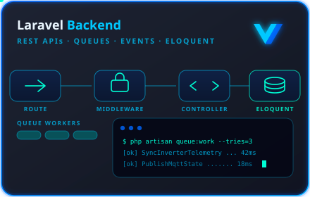
      

        Laravel applications built for the long run: domain-driven structure,
        queued jobs, event sourcing where it helps, hardened auth, and API
        contracts your mobile team will not curse.
      

      

        <b>Includes</b> 
        REST &amp; WebSocket APIs 
        Multi-tenancy &amp; RBAC 
        Payment and billing flows 
        Test suites and CI pipelines
      

    </td>
    <td width="33%" valign="top" align="center">
      <h3>IoT &amp; Energy Systems</h3>
      
      

        From the RS485 cable to the browser tab. Firmware, protocol bridges,
        broker topology, retention policy and the dashboard that finally makes
        the data mean something.
      

      

        <b>Includes</b> 
        ESP32 firmware &amp; OTA 
        Inverter / BMS integration 
        Home Assistant packages 
        Grafana &amp; InfluxDB stacks
      

    </td>
    <td width="33%" valign="top" align="center">
      <h3>AI &amp; Realtime Analytics</h3>
      
      

        Models that run in production, not in a notebook. Forecasting, anomaly
        detection and LLM assistants connected to the same buses that drive the
        hardware.
      

      

        <b>Includes</b> 
        Load &amp; yield forecasting 
        Anomaly / fault detection 
        LLM tooling &amp; RAG 
        Streaming analytics
      

    </td>
  </tr>
</table>

### How an engagement usually runs

| Phase | What happens | Typical output |
| :--- | :--- | :--- |
| **1 · Discovery** | Site survey, register maps, existing schema, real constraints | Written scope + risk list |
| **2 · Architecture** | Data model, protocol choice, topic design, deployment topology | Diagram + decision record |
| **3 · Build** | Iterative delivery in short slices, demoable every week | Running system in staging |
| **4 · Hardening** | Failure injection, reconnect logic, watchdogs, load tests | Test report + runbook |
| **5 · Handover** | Documentation, dashboards, alerting, training | Repo + runbook + walkthrough |
| **6 · Support** | Monitoring, tuning, incremental features | SLA-backed maintenance |

<!-- ========================================================================= -->
<!--  PROFESSIONAL CAPABILITIES (CARD GRID)                                    -->
<!-- ========================================================================= -->

## &nbsp; Professional Capabilities

<i>Eleven areas I work in every week — each card is a hand-built SVG.</i>

  

<table>
  <tr>
    <td width="50%"></td>
    <td width="50%"></td>
  </tr>
  <tr>
    <td width="50%"></td>
    <td width="50%"></td>
  </tr>
  <tr>
    <td width="50%"></td>
    <td width="50%"></td>
  </tr>
  <tr>
    <td width="50%"></td>
    <td width="50%"></td>
  </tr>
  <tr>
    <td width="50%"></td>
    <td width="50%"></td>
  </tr>
  <tr>
    <td width="50%"></td>
    <td width="50%" valign="middle" align="center">
      
      <h3>Need one of these?</h3>
      

        
      

    </td>
  </tr>
</table>

<!-- ========================================================================= -->
<!--  FEATURED PROJECTS                                                        -->
<!-- ========================================================================= -->

## &nbsp; Featured Projects

<!-- ===================================================== Project 01 -->

<table>
  <tr>
    <td width="46%" valign="top">
      
    </td>
    <td width="54%" valign="top">

### 01 · Solar Bridge

A protocol bridge that turns a hybrid solar inverter into a well-behaved
citizen of your smart home. It speaks Modbus RTU over RS485 to the inverter,
normalises the register soup into meaningful entities, and republishes
everything to MQTT with Home Assistant auto-discovery.

**Features**

- Register maps for common hybrid inverter families, versioned as data not code
- Home Assistant MQTT auto-discovery — devices appear with correct units and classes
- Write support for work mode, charge current and time-of-use windows
- Resilient serial layer: CRC validation, backoff, watchdog, hot re-enumeration
- Prometheus endpoint plus InfluxDB line-protocol output
- Runs as a container on a Pi or as a systemd unit on any Linux box

**Tech stack**

</td>
  </tr>
</table>

<!-- ===================================================== Project 02 -->

<table>
  <tr>
    <td width="54%" valign="top">

### 02 · Energy Command Center

One screen that answers the only question that matters: *where is my energy
going right now, and what should happen next?* Live production, consumption,
battery state and tariff windows, with an optimiser that schedules loads
around the cheapest and greenest hours.

**Features**

- Sub-second live tiles driven by WebSockets, no polling
- Battery scheduler that respects tariffs, forecast yield and depth-of-discharge limits
- Yield forecasting from historical output plus weather input
- Anomaly alerts for string underperformance, cell drift and inverter faults
- Multi-site support with per-site roles and export-ready reports
- Mobile-first layout that stays legible on a phone in bright sun

**Tech stack**

</td>
    <td width="46%" valign="top">
      
    </td>
  </tr>
</table>

<!-- ===================================================== Project 03 -->

<table>
  <tr>
    <td width="46%" valign="top">
      
    </td>
    <td width="54%" valign="top">

### 03 · HA Automation Suite

A curated set of Home Assistant packages, blueprints and Lovelace views for
homes that generate their own power. Opinionated defaults, documented entities,
and no YAML archaeology required.

**Features**

- Drop-in packages for solar, battery, EV charging and water heating
- Blueprints for load shifting, surplus diversion and grid-outage behaviour
- Lovelace dashboards tuned for tablets, phones and wall panels
- ESPHome device definitions for the sensors that feed it
- Every automation ships with a written explanation of its trigger logic

**Tech stack**

</td>
  </tr>
</table>

<!-- ===================================================== Project 04 -->

<table>
  <tr>
    <td width="54%" valign="top">

### 04 · Quant Terminal

A trading workstation for people who prefer evidence over vibes. Streaming
market data, a strategy sandbox with honest backtests, and a risk engine that
can veto an order before it ever reaches the exchange.

**Features**

- Normalised WebSocket feeds with automatic reconnect and gap backfill
- Event-driven backtester that replays the same code path as live execution
- Position sizing, exposure caps and kill-switch rules enforced server-side
- Portfolio analytics: drawdown, Sharpe, win rate, per-strategy attribution
- Alerting into MQTT and mobile push, reusing the same bus as the IoT stack

**Tech stack**

</td>
    <td width="46%" valign="top">
      
    </td>
  </tr>
</table>

<!-- ===================================================== Project 05 -->

<table>
  <tr>
    <td width="46%" valign="top">
      
    </td>
    <td width="54%" valign="top">

### 05 · Nexus CRM

A multi-tenant CRM built for solar installers: leads, site surveys, quotations
with live component pricing, installation scheduling and post-install
monitoring — all in the same place the technician already works.

**Features**

- Tenant isolation at the query layer with per-tenant storage and backups
- Quotation builder that prices real BOMs and exports branded PDFs
- Job scheduling with technician calendars and route grouping
- Commissioning checklists that attach photos and meter readings
- Immutable audit trail on every record that touches money
- Webhooks and a documented REST API for downstream tooling

**Tech stack**

</td>
  </tr>
</table>

<!-- ===================================================== Project 06 -->

<table>
  <tr>
    <td width="54%" valign="top">

### 06 · Sentinel Node

ESP32 firmware for field sensor nodes that have to survive on a battery, a
flaky Wi-Fi link and no physical access. Provisioning happens through a captive
portal; updates arrive over the air; failures recover themselves.

**Features**

- Captive-portal provisioning — no credentials baked into the binary
- Signed OTA updates with automatic rollback on boot failure
- Deep-sleep duty cycling with RTC-preserved state
- Store-and-forward buffer so nothing is lost during outages
- Modular sensor drivers: environment, current clamp, pulse meter, contact
- MQTT last-will and birth messages for accurate presence tracking

**Tech stack**

</td>
    <td width="46%" valign="top">
      
    </td>
  </tr>
</table>

<b>More projects worth a look</b>

 

| Project | What it does | Stack | Status |
| :--- | :--- | :--- | :--- |
| **Inverter Register Atlas** | Community-maintained register maps for hybrid inverters, published as versioned data files | `YAML` `Python` | Maintained |
| **MQTT Sentinel** | Broker-side watchdog that detects silent devices and stale retained topics | `Python` `Docker` | Production |
| **Tariff Optimiser** | Computes the cheapest charge/discharge schedule from a tariff plan and forecast | `Python` `FastAPI` | Beta |
| **Blade UI Kit (Neon)** | Dark, glassy Blade + Tailwind components used across the dashboards | `Laravel` `Tailwind` | Maintained |
| **Pulse Meter Node** | Firmware for gas/water pulse meters with debounce tuning and offline buffering | `C++` `ESP32` | Production |
| **Grafana Energy Pack** | Ready-made dashboards for PV, battery and grid metrics from InfluxDB | `Grafana` `Flux` | Maintained |
| **Docker Edge Stack** | Compose stack: Mosquitto, InfluxDB, Grafana, Node-RED, hardened defaults | `Docker` `Linux` | Maintained |
| **LLM Ops Assistant** | Retrieval assistant over runbooks and device documentation | `Python` `LLM` | Experimental |

<!-- ========================================================================= -->
<!--  OPEN SOURCE                                                              -->
<!-- ========================================================================= -->

## &nbsp; Open Source

<table>
  <tr>
    <td width="55%" valign="top">

Most of what I learn came from other people's repositories, so a meaningful
share of my work goes back out under permissive licences.

**What I publish**

- Protocol bridges and register maps — the tedious reverse engineering that
  nobody should have to repeat
- Home Assistant packages and ESPHome definitions for real hardware
- Reusable Laravel and Tailwind building blocks pulled out of client work
- Grafana dashboards and Docker stacks that work on a Raspberry Pi

**How I maintain**

- Semantic versioning with a written changelog
- Issue templates that ask for firmware version, hardware revision and logs
- CI on every pull request — lint, tests, container build
- A `SECURITY.md` on anything that touches a network
- Answers within a few days, even if the answer is "not planned"

</td>
    <td width="45%" valign="top" align="center">

<h3>Contribution principles</h3>

<table>
  <tr><td align="center"><b>1</b></td><td>Document the protocol before you abstract it</td></tr>
  <tr><td align="center"><b>2</b></td><td>Data files beat hard-coded constants</td></tr>
  <tr><td align="center"><b>3</b></td><td>A failing device must not take down the bridge</td></tr>
  <tr><td align="center"><b>4</b></td><td>Every config option needs a default that works</td></tr>
  <tr><td align="center"><b>5</b></td><td>If it is not in the README, it does not exist</td></tr>
</table>

 

</td>
  </tr>
</table>

<!-- ========================================================================= -->
<!--  LATEST ACTIVITY                                                          -->
<!-- ========================================================================= -->

## &nbsp; Latest Activity

<!-- Contribution activity graph -->

  

<!-- Recent commit stream, rendered by the metrics workflow -->

> **Heads up** — the panels under `metrics/` and the snake artwork are produced
> by the two GitHub Actions in this repository. They appear a couple of minutes
> after the first successful run. See [`setup-guide.md`](setup-guide.md).

<!-- ========================================================================= -->
<!--  GITHUB ANALYTICS                                                         -->
<!-- ========================================================================= -->

## &nbsp; GitHub Analytics

<!-- Stats + streak -->
<table>
  <tr>
    <td width="50%" align="center">
      
    </td>
    <td width="50%" align="center">
      
    </td>
  </tr>
</table>

<!-- Top languages + WakaTime-style breakdown -->
<table>
  <tr>
    <td width="50%" align="center">
      
    </td>
    <td width="50%" align="center">
      
    </td>
  </tr>
</table>

 

<!-- Trophies -->
<h3>Trophy Cabinet</h3>

  

<!-- Isometric + classic calendars from the metrics workflow -->
<h3>Contribution Calendar</h3>

<table>
  <tr>
    <td width="50%" align="center">
      
    </td>
    <td width="50%" align="center">
      
    </td>
  </tr>
</table>

 

<h3>Code Volume &amp; Habits</h3>

<table>
  <tr>
    <td width="50%" align="center">
      
    </td>
    <td width="50%" align="center">
      
    </td>
  </tr>
</table>

 

<h3>Languages In Depth</h3>

<table>
  <tr>
    <td width="50%" align="center">
      
    </td>
    <td width="50%" align="center">
      
    </td>
  </tr>
</table>

 

<!-- Aggregate counters -->
<h3>At a Glance</h3>

  
  
  
  

<!-- ========================================================================= -->
<!--  SNAKE                                                                    -->
<!-- ========================================================================= -->

## &nbsp; Contribution Snake

<i>Regenerated every day at 00:15 UTC by <a href="./.github/workflows/snake.yml"><code>snake.yml</code></a>.</i>

  

<picture>
  <source
    media="(prefers-color-scheme: dark)"
    srcset="https://raw.githubusercontent.com/electroiot/electroiot/output/github-snake-dark.svg"
  />
  <source
    media="(prefers-color-scheme: light)"
    srcset="https://raw.githubusercontent.com/electroiot/electroiot/output/github-snake.svg"
  />
  
</picture>

<!-- ========================================================================= -->
<!--  ACHIEVEMENTS                                                             -->
<!-- ========================================================================= -->

## &nbsp; Achievements

 

### Engineering milestones

| Milestone | Detail | Why it mattered |
| :--- | :--- | :--- |
| **First device online** | An ESP32 publishing temperature to a broker on a breadboard | Proved the whole pipeline could be understood end to end |
| **Register map cracked** | Reverse-engineered a hybrid inverter's Modbus map from packet captures | Unlocked every project that followed |
| **Zero-touch fleet** | OTA rollout across field devices with automatic rollback | No more driving to sites for a firmware bug |
| **Sub-second dashboard** | Replaced polling with WebSockets across the energy stack | Operators started trusting the numbers |
| **Forecast in production** | Yield prediction driving real battery scheduling decisions | AI stopped being a demo and started saving money |
| **Multi-tenant launch** | CRM serving multiple installers with isolated data and billing | Turned a one-off tool into a product |
| **Open-sourced the bridge** | Published the inverter bridge with documentation | Other people's inverters started appearing in the issue tracker |

<!-- ========================================================================= -->
<!--  ROADMAP                                                                  -->
<!-- ========================================================================= -->

## &nbsp; Roadmap

<table>
  <tr>
    <th width="14%">Phase</th>
    <th width="30%">Theme</th>
    <th width="36%">Deliverables</th>
    <th width="20%">Progress</th>
  </tr>
  <tr>
    <td align="center"><b>Q1</b></td>
    <td><b>Telemetry Foundation</b> Bridges, brokers, retention</td>
    <td align="left">
      Inverter register atlas v2 
      Hardened MQTT topology 
      InfluxDB retention policies
    </td>
    <td><code>████████████████████</code> <b>Complete</b></td>
  </tr>
  <tr>
    <td align="center"><b>Q2</b></td>
    <td><b>Realtime Layer</b> WebSockets, dashboards</td>
    <td align="left">
      Energy Command Center v1 
      Mobile-first Lovelace views 
      Grafana energy pack
    </td>
    <td><code>████████████████████</code> <b>Complete</b></td>
  </tr>
  <tr>
    <td align="center"><b>Q3</b></td>
    <td><b>Intelligence</b> Forecasting, optimisation</td>
    <td align="left">
      Yield &amp; load forecasting 
      Tariff-aware battery scheduler 
      Anomaly detection alerts
    </td>
    <td><code>██████████████░░░░░░</code> <b>In progress · 70%</b></td>
  </tr>
  <tr>
    <td align="center"><b>Q4</b></td>
    <td><b>Scale &amp; Fleet</b> Multi-site, OTA, RBAC</td>
    <td align="left">
      Fleet management console 
      Signed OTA channels 
      Per-site roles and reporting
    </td>
    <td><code>████████░░░░░░░░░░░░</code> <b>Started · 40%</b></td>
  </tr>
  <tr>
    <td align="center"><b>Next</b></td>
    <td><b>Edge AI</b> On-device inference</td>
    <td align="left">
      TinyML fault classification 
      Local LLM ops assistant 
      Offline-first decisioning
    </td>
    <td><code>███░░░░░░░░░░░░░░░░░</code> <b>Research · 15%</b></td>
  </tr>
</table>

<!-- ========================================================================= -->
<!--  CURRENTLY WORKING ON                                                     -->
<!-- ========================================================================= -->

## &nbsp; Currently Working On

<table>
  <tr>
    <td width="50%" valign="top">

### In the editor right now

- **Tariff-aware battery scheduler** — turning a forecast plus a tariff plan
  into an hour-by-hour charge/discharge plan, with a dry-run mode so it can be
  audited before it touches a relay.
- **Fleet console** — one place to see every deployed node, its firmware
  version, signal strength and last heartbeat.
- **Signed OTA channels** — stable, beta and canary rings with automatic
  rollback on a failed boot.
- **Neon component kit** — extracting the dashboard UI into reusable Blade and
  Vue components so every project stops re-inventing the card.

</td>
    <td width="50%" valign="top">

### On the bench

- **CAN-bus BMS support** — moving beyond RS485 for battery packs that speak CAN.
- **Three-phase metering** — per-phase current clamps with proper power-factor
  handling.
- **Edge inference** — running a small fault-classification model directly on
  the gateway so alerts survive an internet outage.
- **Documentation overhaul** — every repository getting a real quick-start,
  an architecture note and a troubleshooting page.

</td>
  </tr>
</table>

<!-- ========================================================================= -->
<!--  LEARNING                                                                 -->
<!-- ========================================================================= -->

## &nbsp; Learning

<table>
  <tr>
    <th align="left" width="240">Topic</th>
    <th align="left" width="300">Progress</th>
    <th align="left">Why</th>
  </tr>
  <tr>
    <td><b>Rust for embedded</b></td>
    <td><code>████████░░░░░░░░░░░░</code> <b>40%</b></td>
    <td>Memory safety on constrained targets</td>
  </tr>
  <tr>
    <td><b>TinyML / edge inference</b></td>
    <td><code>██████░░░░░░░░░░░░░░</code> <b>30%</b></td>
    <td>Decisions that survive an offline gateway</td>
  </tr>
  <tr>
    <td><b>Kubernetes at the edge</b></td>
    <td><code>██████████░░░░░░░░░░</code> <b>50%</b></td>
    <td>Fleet-scale deployment beyond compose</td>
  </tr>
  <tr>
    <td><b>Power systems theory</b></td>
    <td><code>████████████░░░░░░░░</code> <b>60%</b></td>
    <td>Better decisions about real electrical loads</td>
  </tr>
  <tr>
    <td><b>Retrieval-augmented LLMs</b></td>
    <td><code>█████████████░░░░░░░</code> <b>65%</b></td>
    <td>Assistants grounded in actual runbooks</td>
  </tr>
  <tr>
    <td><b>Time-series forecasting</b></td>
    <td><code>██████████████░░░░░░</code> <b>70%</b></td>
    <td>Yield and load prediction that holds up</td>
  </tr>
</table>

<!-- ========================================================================= -->
<!--  FUN FACTS                                                                -->
<!-- ========================================================================= -->

## &nbsp; Fun Facts

<table>
  <tr>
    <td width="50%" valign="top">

- My first "production incident" was a relay clicking every two seconds at
  3 AM because of a missing hysteresis check. I now write hysteresis first.
- I debug hardware with an oscilloscope and software with `printf`. Both are
  correct choices, and I will defend that.
- The most valuable file in my energy stack is a YAML register map, not a
  single line of application code.
- I have re-flashed a device from a rooftop in monsoon rain. Twice.
- Every dashboard I build gets tested on a phone in direct sunlight before it
  is considered finished.
- I keep a physical notebook for protocol captures. Paper never loses its
  connection.

</td>
    <td width="50%" valign="top">

- Favourite debugging tool: a second person to explain the bug to.
- Preferred deployment window: when the sun is high and the batteries are full.
- Coffee is instrumentation, not a personality.
- I read datasheets end to end. The interesting part is always in a footnote.
- The best commit message I ever wrote was six words long and saved a colleague
  four hours a year later.
- I will always choose a boring, well-documented protocol over a clever one.

</td>
  </tr>
</table>

<table>
  <tr>
    <td align="center" width="25%"><b>Editor</b> VS Code &amp; PhpStorm</td>
    <td align="center" width="25%"><b>Shell</b> bash + tmux</td>
    <td align="center" width="25%"><b>OS</b> Linux, always</td>
    <td align="center" width="25%"><b>Theme</b> Dark, obviously</td>
  </tr>
</table>

<!-- ========================================================================= -->
<!--  SUPPORT                                                                  -->
<!-- ========================================================================= -->

## &nbsp; Support

<table>
  <tr>
    <td width="60%" valign="top">

Everything I open-source is free and stays free. If something here saved you a
weekend of reverse engineering, the most useful things you can do are:

- **Star the repository** you found helpful — it is the signal that decides what
  I maintain next.
- **Open a good issue.** Firmware version, hardware revision, a log excerpt and
  what you expected. That is a gift.
- **Send a register map.** Every new inverter or BMS you document helps someone
  with the same hardware next month.
- **Write about it.** A blog post or forum answer reaches people that a README
  never will.
- **Hire me for the hard part.** Sponsored work on shared infrastructure benefits
  every user of the project.

</td>
    <td width="40%" valign="top" align="center">

  

  

</td>
  </tr>
</table>

<!-- ========================================================================= -->
<!--  CONTACT                                                                  -->
<!-- ========================================================================= -->

## &nbsp; Contact

<h3>Let's build something that stays online</h3>

  Solar telemetry that will not drop out. A Laravel platform that scales past
  the pilot. Firmware you can update without a ladder. 
  If that sounds like your problem, I would like to hear about it.

 

<table>
  <tr>
    <td align="center" width="25%">
      
       electroiot.in
    </td>
    <td align="center" width="25%">
      
       @electroiot
    </td>
    <td align="center" width="25%">
      
       hello@electroiot.in
    </td>
    <td align="center" width="25%">
      
       repositories
    </td>
  </tr>
</table>

 

<table>
  <tr>
    <th align="left">Good fit</th>
    <th align="left">Response time</th>
  </tr>
  <tr>
    <td>Solar / BMS telemetry integrations</td>
    <td>Within 2 business days</td>
  </tr>
  <tr>
    <td>Laravel platform build or rescue</td>
    <td>Within 2 business days</td>
  </tr>
  <tr>
    <td>ESP32 firmware and fleet OTA</td>
    <td>Within 2 business days</td>
  </tr>
  <tr>
    <td>Realtime dashboards and analytics</td>
    <td>Within 2 business days</td>
  </tr>
  <tr>
    <td>Open-source issue on my repositories</td>
    <td>Usually within a week</td>
  </tr>
</table>

<!-- ========================================================================= -->
<!--  FOOTER                                                                   -->
<!-- ========================================================================= -->

<h3>Thanks for scrolling this far</h3>

  If you build something with any of this, tell me about it. 
  <b>Good systems are quiet — that is the whole goal.</b>

  

 


  Crafted with SVG, patience and far too much coffee &nbsp;·&nbsp;
  <a href="LICENSE">MIT Licensed</a> &nbsp;·&nbsp;
  <a href="setup-guide.md">Setup Guide</a> &nbsp;·&nbsp;
  <a href="README_assets.md">Asset Reference</a>

<!-- verified render 2026-09 -->
